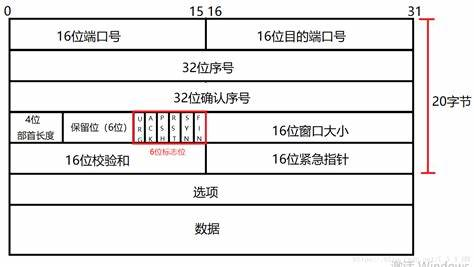
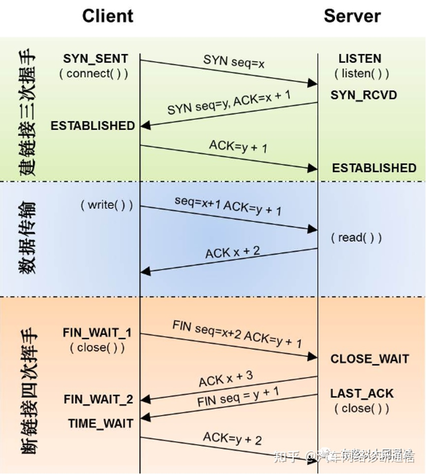

{"cells":[{"cell_type":"markdown","metadata":{},"source":[]}],"metadata":{"interpreter":{"hash":"916dbcbb3f70747c44a77c7bcd40155683ae19c65e1c03b4aa3499c5328201f1"},"kernelspec":{"display_name":"Python 3.8.10 64-bit","language":"python","name":"python3"},"language_info":{"name":"python","version":"3.8.10"},"orig_nbformat":4},"nbformat":4,"nbformat_minor":2}
# 网络编程

## 1. 网络结构模式

###  C/S 结构

- 优点
    -  响应速度快
    - 操作界面漂亮
- 缺点
    - 需要安装专门的软件
    - 对客户端的操作系统有限制，不能跨平台

### B/S 结构

- 浏览器Browser/服务器Sever模式

- 优点
    - 维护方便，分布性强，开发简单
- 缺点
    - 通信开销大，系统和数据的安全性难以保障
    - 个性特点明显降低
    - 协议一般是固定的
    - 是请求-响应模式，通常动他刷新页面，响应速度明显降低

## 2. MAC地址

>Media Acess Control Address 

独一无二的，48位的串行号，表示为12个16进制数字

前三个字节分配给三个制造商

但是一台设备上有多个网卡

- 网卡的主要功能：
    1. 数据的封装与解封装
    2. 链路管理
    3. 数据编码与译码

## 3. IP地址
>Internet Protocol Address

IP地址是一个 32为的二进制数，通常分割为4个8位二进制数（4个字节）

>IP地址编制方式

- A类IP地址

    一个A类IP地址，由1字节的网络地址和3字节的主机地址，只有126个网络地址，容纳1600多万台主机

    一般用于广域网

    1.0.0.1~126.255.25.2541

- B类IP地址

    由2字节的网络地址和2字节的主机地址组成

    一般用于局域网
    
    128.0.0.1~191.255.255.254 最后一个是广播地址

- C类局域网地址

- 特殊的网址

    0.0.0.0 对应于当前主机
    
    255.255.255 当前子网的广播地址（向所有地址发送消息）
    
    以11110开头的E类地址都保留用于将来和实验用 

    不能以127开头，127.0.0.1 到 127.255.255.255用于回路测试，如127.0.0.1可以代表本机地址

>子网掩码 
   
- subnet mask

    用来指明IP地址的那些位表示是网络与主机标识

    255.255.0.0|192.168.1.1

    <u>11111111.11111111.00000000.00000000</u>
    
    0000111111.000001.00000001.000000001

## 4. 端口 port
- 由16位二进制构成 表示65536 即2^16个端口

### 端口类型

1. 周知端口(Well Know Ports)
    
    从0到1023端口，他们紧密地绑定于一些特殊的服务

    21-FTP 23-Telnet 80-WWW 

    139用于 NetBios 与TCP/IP 之间的通信，不能手动更改

2. 注册端口(Registered Ports)
    
    从1024到49151，他们松散地绑定于一些服务

3. 动态端口/私有端口

    从49152到65535

## 5.网络模型
### OSI参考模型/七层参考模型
- __物数网传会表应__
    | 名字|作用
    | --- |---|
    |物理层       | 网线，接口类型，传输介质速率，转换高低电平
    |数据链路层   | 建立逻辑地址寻址(MAC地址封装)
    |网络层       | Ip选址及路由选择
    |传输层      |网络地址寻址（IP），定义一些传输协议和端口号，TCP/UDP，建立、管理和维护端到端链接
    |会话层 | 建立、管理和维护会话
    |表示层|对数据进行封装、解释、加密、解压缩等，把数据转化为人能看懂的东西
    |应用层|网络服务与用户的API，为应用程序提供网络服务
---
### TCP/IP 四层模型
- TCP/IP协议族 不单指两个协议

名字|作用
---|---
应用层|ping、telnet、OSPF、DNS--将应用层、表示层、应用层3合一
传输层|TCP UDP
网络层|ICMP IP
网络接口层|ARP Data Link RARP

## 6.协议
### 常见协议
- 应用层常见协议

     FTP(File Transfer Protocal), HTTP(Hyper Text Transfer P),NFS(Network File System网络文件系统)
- 传输层常见协议
    
    TCP(Transmission Control Protocol), UDP(User Datagram P)
- 网络层常见协议
  
    IP(Internet P),  ICMP(Internet Control Message Protocl英特网控制报文协议)， IGMP(Internet Group Management Protocol英特网组管理协议)
-  网络接口常见协议

    ARP(Addres Resolution Protocol 地址解析协议)，RARP(Reverse Address Resolution Protocol反向地址解析协议）

### ARP 协议

  类型|硬件类型|协议类型|硬件地址长度|协议地址长度|操作|发送端以太网地址|发送端IP地址|目的端以太网地址|目的端IP地址
  ---|---|---|---|---|---|---|---|---|---
内容|1|0x800|6|4|1|01:02:03:04:05:06|192.168.1.2|00:00:00:00:00:00|192.168.1.3
字节|2 |2|1|1|2|6|4|6|4

共28个字节，再加上以太网真协议的头和尾

用IP地址向局域网广播，主机返回应答物理地址

## 7.通信流程

inet_pton inet_ntop p:point n:network 的整数
### UDP
    用户数据报协议，面向无连接，可以单播，多播，广播，面向数据报的一种协议。
    是不可靠的一种协议，通讯双方是无连接，不保证消息到达与正确。

### TCP

    teleport control protocol

>TCP 与 UDP

区别|UDP|TCP
---|---|---
是否创建链接|无链接|创建链接
是否可靠|不可靠|可靠
连接的对象个数|一对一 一对多 多对多|支持一对一
传输的方式|面向数据包|面向字节流
首部开销|8个字节|最少20个字节
使用场景|实时应用 （视频会议，直播）|可靠性高的应用 （文件传输）

>TCP通信的流程
- 服务器端（被动接受链接的角色）

    1. 创建一个用于监听的套接字
        - 监听：监听由客户端发起的链接
        - 套接字： 其实是一个文件描述符
    2. 将这个文件描述符与本地的IP和PORT绑定（服务器的地址信息）
        - 客户端链接服务器的时候就是用的这个IP和PORT
    3. 设置监听:监听的fd开始工作
    4. 阻塞等待
        - 当有客户端发起链接，解除阻塞，接受客户端链接，会得到一个和客户端通信的套接字（fd)
    5. 通信
        - 接受数据
        - 发售数据
    6. 通信结束，断开链接
  
- 客户端

    1. 创建一个用于通信的套接字（fd）
    2. 链接服务器，需要指定IP和端口
    3. 成功链接了，客户端可以直接和服务器通信
        - write
        - read
    4. 通信结束，断开链接

>套接字函数

    #include<sys/types.h>
    #inlude<sys/socket.h>
    #include<arpa/inet.h>   //包含了这个头文件，上面的两个就不用包含了

    int socket(int domain, int type, int protocol);
        - domin : 表示协议族
            AF_Unix,AF_INET,AF_INET6
        - type :通信过程中使用的协议类型 
            SOCK_STREAM,SOCK_DGRAM
        - protocol : 具体的一个协议
            从协议族中选择，一般写0
                sock_stream默认tcp
                sock_dgram默认udp
        - 成功 fd，失败 -1

    int bind(int sockfd, const struct sockaddr* addr,socklen_t addrlen);
    
    int listen(int sockfd,int backlog);
    
    int accept(int sockfd, struct sockaddr *addr, socklen_t *addrlen);
    int accept4(int sockfd, struct sockaddr *addr,socklen_t *addrlen, int flags);
        - 返回值： 成功返回 cfd
                    失败 -1

     int connect(int sockfd, const struct sockaddr *addr,socklen_t addrlen);

> 三次握手
- 第一次握手
    1. 客户端将SYN位置为1
    2. 生成一个随机的32位序号seq= J ，这个序号后面可以携带数据（数据的大小）
- 第二次握手：
    1. 服务器接受客户端的链接：ACK=1
    2. 服务器会回发一个确认序号：ack= 客户端的序号+数据长度+SYN/FIN（按一个字节算）
    3. 服务器向客户端发起链接请求:SYN=1
    4. 服务器会生成一个随机序号：seq = K
- 第三次握手
    1. 客户端应答服务器的SYN请求发送ACK=1
    2. 客户端恢复收到的服务器的数据：ack = 服务端的序号 + 数据长度 +SYN/FIN（按一个字节算）

## 8.TCP滑动窗口

- 窗口理解为缓冲区大小
- 双方都有发送与接受缓冲区（窗口）
- 大小随发送与接受数据改变

>发送方的缓冲区
- 空闲空间
- 已发送，但未接受数据
- 还没有发送出去的数据

>接收方的缓存区
- 空间的空间
- 已接受的数据

> mss 
- Maximum Segment Size 一条数据的最大数据量

> ACK ack
- ACK 应答标志位
- ack 应答校验

>滑动窗口
1. 第一次握手，客户端向服务器发起链接，客户端的滑动窗口是4096，mms（一次发送最大数据）是1460
2. 第二次握手， 服务器接受链接情况，告诉客户端，服务器的窗口大小是6144，mms是1024
3. 第三次握手
4. 4~10 客户端给服务器每次发送1k数据
5.  11次，服务器告诉客户端，发送的6k数据已经收到，存储在缓冲区内，缓冲区数据已经处理了2k，窗口大小时2k
5. 12次，服务器告诉客户端，发送的6k数据已收到，存在缓冲区中，缓存区数据已经处理了2K,窗口大小4096
6. 第一次挥手 13次 客户端主动与服务器断开链接 FIN，可以带数据 
7. 第二次挥手 14次 服务器回复 ACK同意断开链接 表示接受到之前的数据，
8. 14次~17次 并不断发送滑动窗口大小表示处理缓冲区数据完毕
9. 第三次挥手 18次 服务器发送FIN 请求断开链接
10. 第四次挥手 19次，客户端回复ACK表示同意服务器断开请求

### 9.TCP四次挥手
- 当调用了close()，会使用TCP协议进行4次挥手
- 客户端和服务端都可以主动发起断开链接，谁先调用close()谁就发起
- 双向断开

1. FIN M            →
2. ack M+1          ←
3. FIN N            ←
4. ACK =1 ack = K+1 →

### 10.TCP通信并发
- 思路
    1. 一个父进程，多个子进程
    2. 父进程负责等待并接受客户端的链接
    3. 子进程：完成通信，accept一个就fork一个子进程

### 11.TCP 状态转换

    在第三次挥手 LAST_ACK 会等待2msl，在这之中会等待对方第四次握手的ACK——进入TIME_WAIT状态，接收到 FIN 并发送 ACK

    msl: 官方建议2分钟，实际上是30s

>半关闭状态

- 当TCP连接中 A向B发送FIN请求关闭（第一次挥手），
另一端B回应 ACK之后（A端进入FIN_WAIT_2状态，第二次挥手），
没有立即发送FIN给A端。

- 此时A 处于半链接状态，关闭了写端，不能向B发送，但仍可以收到B端的数据

        int shutdown(int sockfd , int how);
    
        - how: SHUT_RD(0),SHUT_WR(1),SHUT_RDWR(2)   

## 12.端口复用
        #include <sys/socket.h>

       ssize_t recv(int sockfd, void *buf, size_t len, int flags);

       ssize_t recvfrom(int sockfd, void *buf, size_t len,int flags,struct sockaddr *src_addr, socklen_t *addrlen);

       ssize_t recvmsg(int sockfd, struct msghdr *msg, int flags);

- 查看网络信息相关的命令
    - netstat
     - -a 所有的socket
     - -p 显示正在使用socket的程序的名称
     - -n 直接使用IP，而不通过域名服务器

>在接收到第三次挥手消息 FIN后自身进入到TIME_WAIT 状态2msl，此时端口被占用，在次启动服务端会绑定端口错误

    #include <sys/types.h>          
    #include <sys/socket.h>

    int getsockopt(int sockfd, int level, int optname,void *optval, socklen_t *optlen);
    int setsockopt(int sockfd, int level, int optname,const void *optval, socklen_t optlen);

    - sockfd
    - level :
        - 级别 SOL_SOCKET（端口复用的级别）
    - optname :
        - SO_REUSERADDR
        - SO_REUSEPORT
    - optval:
        - 端口复用的值（整形） 1/0 -> Y/N
    - optlen:
        - optval的参数大小
        
- 端口复用需要在服务器绑定端口之前设置